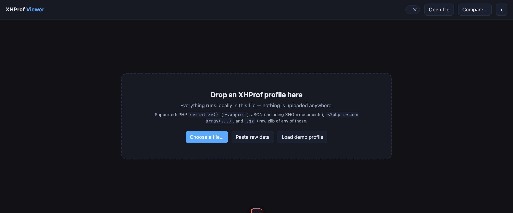
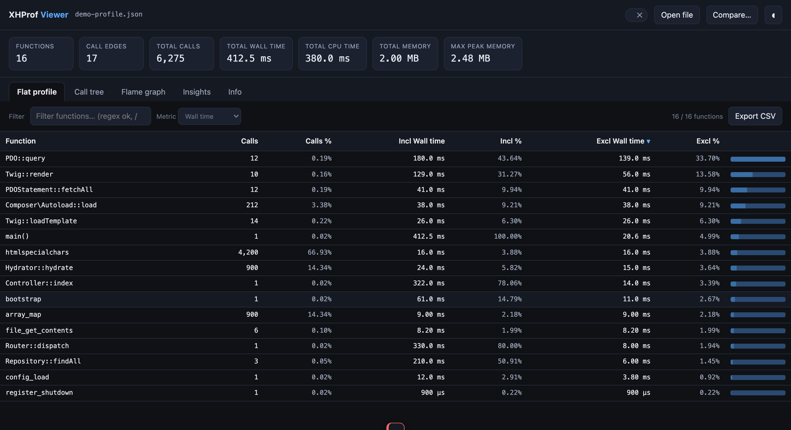
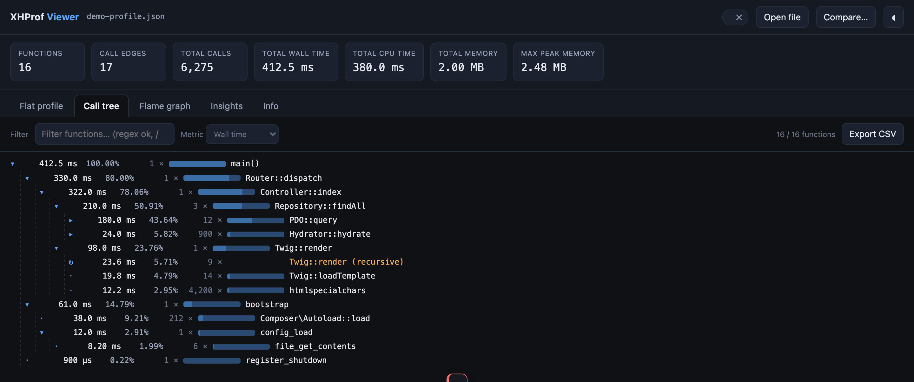
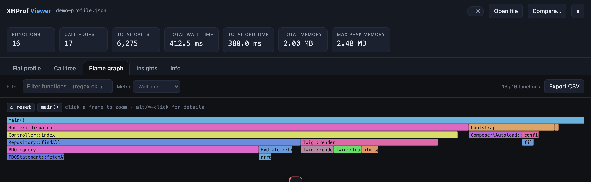
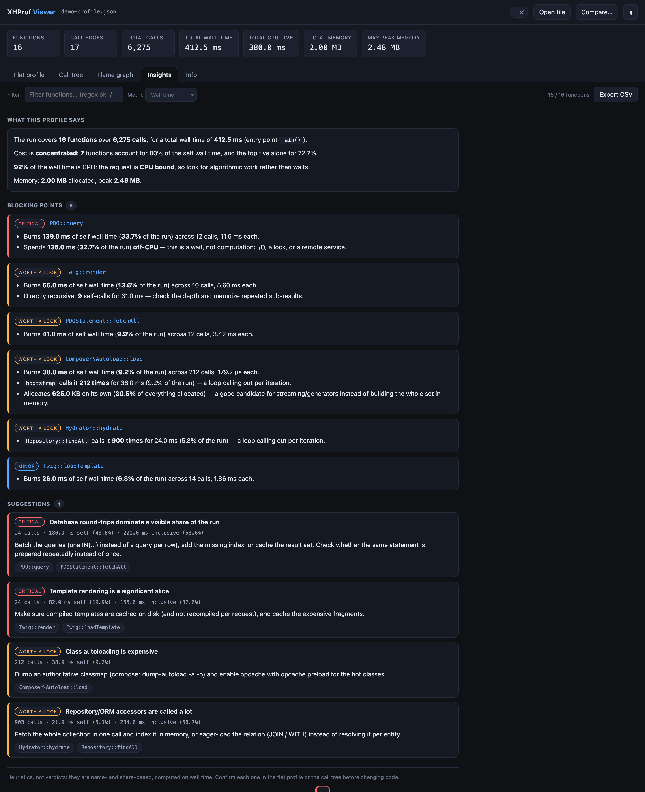
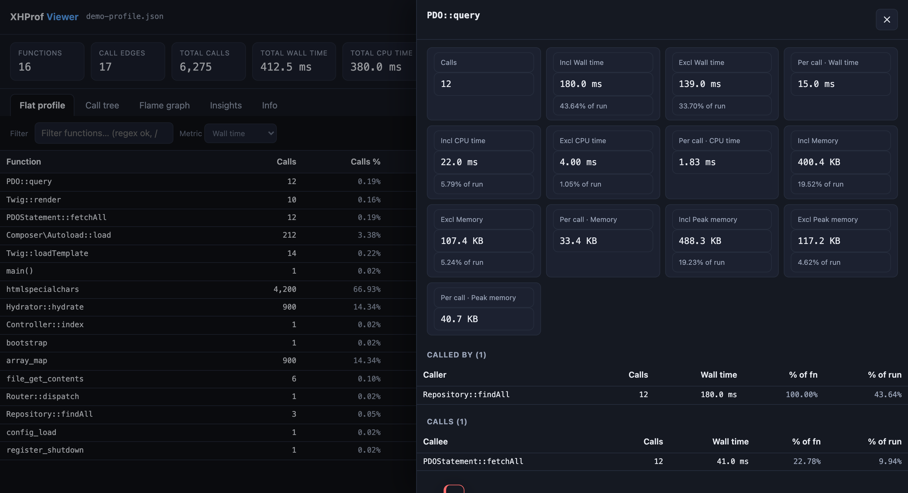
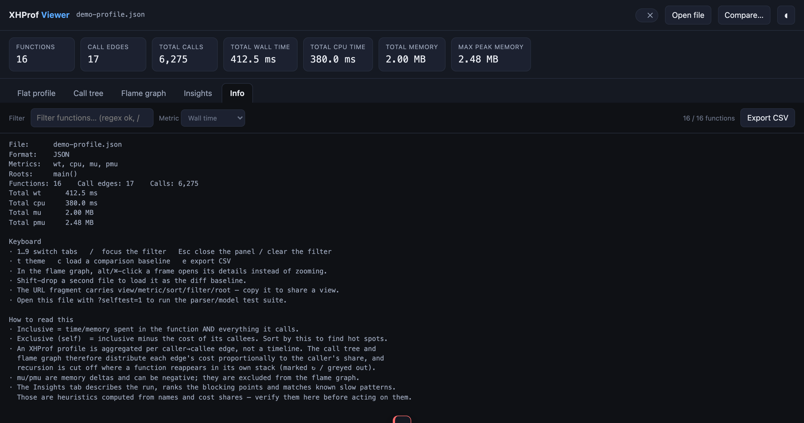
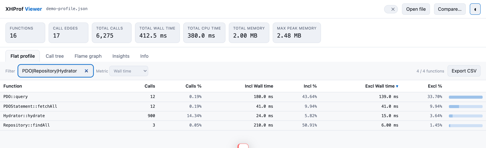

# XHProf Viewer — descriptif

Fichier unique `xhprof-viewer.html` (2105 lignes), autonome : pas de build, pas de dépendance, pas de réseau. On l'ouvre dans un navigateur, on y dépose un profil, tout est traité localement — et une `Content-Security-Policy` en `default-src 'none'` le garantit côté navigateur au lieu de le promettre dans un README.

## 0. En un coup d'œil

Ouvrir `xhprof-viewer.html` dans un navigateur, y déposer un profil, et lire le résultat. Le bouton
*Load demo profile* charge un profil synthétique intégré — c'est lui qui a servi à produire les
captures ci-dessous, elles sont donc reproductibles à l'identique (voir `docs/screenshots.js`).

### Charger un profil

Drag & drop n'importe où sur la page, *Choose a file…*, collage de contenu brut, ou le profil de démo.

### Flat profile — où passe le temps

La table triable de toutes les fonctions : appels, inclusif, exclusif, et leurs parts du run. On trie
par **Excl** pour trouver les vrais points chauds, on clique une ligne pour ouvrir son détail.

### Call tree — quel chemin y mène

L'arbre agrégé depuis la racine, chaque arête pondérée par la part de son appelant. La récursion est
coupée à la première répétition dans la pile et marquée `↻ (recursive)`.

### Flame graph — la même chose en surfaces

Largeur = part de la racine, profondeur = pile d'appels. Clic pour zoomer, `Alt`/`Cmd`/`Ctrl`+clic
pour ouvrir le détail. Vue désactivée sur les métriques mémoire (deltas potentiellement négatifs).

### Insights — ce que le profil raconte

Résumé du run, points bloquants classés par sévérité avec la raison de leur présence, et suggestions
à base de motifs de noms avec correctif concret. Les puces sont cliquables vers les fonctions visées.

### Panneau de détail — naviguer le graphe

Toutes les métriques d'une fonction (inclusif / exclusif / par appel, et leur part du run), ses
appelants et ses appelés. Les lignes sont cliquables : le panneau sert de navigateur d'arêtes.
`Esc` ferme.

### Info — provenance et mode de lecture

Fichier, format détecté, métriques, racines, totaux, métadonnées brutes du profil, l'aide-mémoire
clavier, et un rappel de ce que signifient inclusif et exclusif.

### Filtre, métrique, thème, export

Le filtre accepte une regex (repli sur sous-chaîne si elle ne compile pas, **et il le dit**) et
alimente aussi l'export CSV. La métrique active redessine toutes les vues. Le thème clair est persisté.

## 1. Entrée

**Formats acceptés** (détectés par sniffing, avec repli sur essais successifs) :

| Format | Détection | Parseur |
|---|---|---|
| PHP `serialize()` (`*.xhprof`) | préfixe `a:`/`O:`/`s:`/`i:`/`b:`/`d:`/`N:` | `phpUnserialize()` maison |
| JSON (dont documents XHGui) | `{` ou `[` | `JSON.parse` |
| Littéral PHP `<?php return array(...);` | `<?php`, `return`, `array(`, `[` | `phpLiteralParse()` tolérant |
| gzip de n'importe lequel | magic `1f 8b` | `DecompressionStream("gzip")` |
| zlib/deflate brut de n'importe lequel | magic `78 01/5e/9c/da` | `DecompressionStream("deflate")` puis `"deflate-raw"` |

Trois subtilités d'implémentation :

- `phpUnserialize` compte les longueurs de chaîne en **octets** (il parcourt les code points en additionnant la largeur UTF-8, `xhprof-viewer.html:273`) et aplatit les objets `O:` en maps en retirant le mangling privé/protégé.
- Si le fichier contient des **octets non-UTF-8** (chaînes binaires dans un `serialize()`), le décodage UTF-8 les remplacerait par `U+FFFD` et désynchroniserait ce comptage : dans ce cas seulement, le contenu est redécodé en latin-1 et le parseur bascule en mode « un caractère = un octet ».
- Les types `serialize()` non gérés échouent avec un message explicite plutôt qu'un `unknown type` : `r:`/`R:` (références arrière), `C:` (objets `Serializable`). Les enums `E:` sont acceptées et rendent le nom du cas.

Les clés sont stockées dans des objets **sans prototype** (`Object.create(null)`) : une fonction ou une métrique nommée `__proto__` ou `constructor` reste une clé normale au lieu de corrompre l'objet.

**Localisation du profil** (`extractProfile`, ligne 434) : accepte une edge map nue ou n'importe quel wrapper. Il sonde `profile`, `profiles`, `prof`, `data`, `0`, puis tout objet imbriqué d'un niveau. La reconnaissance est structurelle (clé contenant `==>` ou `main()`, ou valeur portant en **propriété propre** `wt`/`ct`/`cpu`/`samples`). Le reste est conservé comme **métadonnées** et affiché dans l'onglet Info — c'est ainsi que l'URL, les timestamps et le contexte requête des documents XHGui survivent.

**Chargement** : drag & drop sur toute la page, sélecteur de fichier, collage de contenu brut (`Ctrl`/`Cmd`+`Entrée`), ou profil de démo synthétique intégré. Le parsing affiche un bandeau *Parsing…* et rend une frame avant de bloquer le thread, donc l'attente est visible sur les gros fichiers. **Un fichier illisible ne détruit plus la session en cours** : si un profil est déjà chargé, l'erreur part en toast et la vue reste en place.

## 2. Modèle de données

XHProf stocke une entrée par **arête appelant→appelé** (`parent==>child`). `buildModel()` (ligne 487) en dérive un modèle par fonction :

- **inclusif** — somme de la métrique sur les arêtes où la fonction est l'appelée (elle *et tout ce qu'elle appelle*)
- **kids** — somme sur les arêtes où elle est l'appelante
- **exclusif / self** — `inclusif − kids`
- `parents`/`children` — les arêtes brutes, utilisées par le panneau de détail

Cas limites traités : une fonction jamais appelée (profils sans `main()`) voit son inclusif rempli depuis la somme de ses callees, sinon tous les totaux tomberaient à zéro. Les **racines** = `main()` d'abord, puis toute fonction que personne n'appelle (dédupliquées via un `Set`, testées en O(1) partout ensuite) ; à défaut, la plus coûteuse. Plusieurs racines = plusieurs graphes fusionnés (runs agrégés, profiler démarré tard) → un sélecteur de racine apparaît dans la barre d'outils. Les **totaux** = somme des inclusifs des racines, avec repli sur la somme des self quand c'est nul ou incohérent.

**Métriques** découvertes dans les données, pas codées en dur. Les connues sont ordonnées et étiquetées (`wt`, `cpu`, `utime`, `stime`, `mu`, `pmu`, `samples`), les autres clés numériques sont ajoutées à la suite. L'unité pilote le formatage (µs/ms/s, B/KB/MB/GB, entiers). La métrique active vaut wall time par défaut et est commutable — toutes les vues se redessinent dessus.

## 3. Vues

Un bandeau de KPI surmonte les onglets : nombre de fonctions, d'arêtes, d'appels, plus un total par métrique (`pmu` est présenté comme *max peak memory* — sommer des pics n'a pas de sens), et le delta vs baseline quand une comparaison est chargée.

Les vues sont **rendues à la demande** (`invalidate()` / `renderActive()`, ligne 629) : changer de métrique marque les six vues sales, mais seule la vue active est reconstruite — reconstruire 20 000 rectangles de flamme et toute l'analyse pour des onglets cachés était le plus gros coût du fichier. Les clics sont **délégués** par conteneur (un listener sur `#flame`, `#insight`, `#tree`, `#diff`, `#pBody`) au lieu d'un handler par élément.

**Flat profile** — table triable : fonction, appels, appels %, inclusif, inclusif %, exclusif, exclusif %, plus une barre proportionnelle au self, **calibrée sur tout l'ensemble filtré** (le bouton *Show more* ne recalibre donc pas les lignes déjà à l'écran). Chaque colonne possède **sa propre clé de tri**, y compris les colonnes de pourcentage. Clic ou `Entrée`/`Espace` sur un en-tête pour trier (`aria-sort` suit), clic sur ligne pour ouvrir le panneau. Rendu plafonné à 250 lignes avec un bouton *Show more* (+500).

**Call tree** — arbre agrégé pondéré par arête depuis la racine choisie. Comme un profil XHProf n'est pas une timeline, le coût de chaque arête est **réparti proportionnellement** : la valeur d'un enfant est mise à l'échelle par `valeurParent / inclusifParent` (`childEdgesScaled`, ligne 951). Enfants construits paresseusement au dépliage, `role="tree"` / `aria-expanded` à jour. Quand une fonction réapparaît dans sa propre chaîne d'ancêtres, la branche est coupée et marquée `↻ (recursive)` — c'est ce qui garantit la terminaison sur graphes cycliques.

**Flame graph** — même pondération, en rectangles imbriqués (largeur = part de la racine, une ligne par profondeur, couleur hashée depuis le nom). Bornes : profondeur 48, 20 000 frames, tranche minimale à 0,08 %. Clic pour zoomer avec fil d'Ariane et reset ; `Alt`/`Cmd`/`Ctrl`+clic ouvre le détail. **Désactivé pour la mémoire** : `mu`/`pmu` sont des deltas pouvant être négatifs, une disposition proportionnelle n'y aurait aucun sens — la vue l'explique et renvoie vers wall time/CPU/appels.

**Insights** — l'onglet analytique. Il raisonne sur wall time si disponible, sinon CPU, samples, user time, et signale explicitement quand il retombe sur les seuls compteurs d'appels. Trois sections :

- *What this profile says* : taille du run, concentration du coût (combien de fonctions pour atteindre 80 % du self → concentré / moyennement étalé / très étalé), ratio CPU/wall (I/O bound sous 55 %, CPU bound au-delà de 85 %), mémoire allouée et pic, et alerte quand le seul volume d'appels (>200k) fait de l'overhead PHP une part de la facture.
- *Blocking points* : jusqu'à 12 fonctions, dédupliquées et classées par sévérité (*critical* / *worth a look* / *minor*), chacune accompagnée des raisons accumulées — self ≥ 4 % du run ; temps off-CPU (`wt − cpu`) ≥ 8 % (une attente, pas du calcul) ; appel unitaire coûteux (≥ 100 ms inclusif/appel et ≥ 8 % du run) hors nœuds de tronc ; gros volume (≥ 5000 appels pour ≥ 2 % de self) ; **fan-out type N+1** (un appelant invoquant un appelé ≥ 50 fois pour ≥ 5 % du run) ; récursion directe ≥ 5 % ; gros allocateurs détenant ≥ 20 % du total alloué. Les racines sont exclues partout — `main()` à 100 % d'inclusif n'est pas une trouvaille.
- *Suggestions* : ~17 règles à base de motifs sur les noms, chacune avec seuil (part de coût **ou** nombre d'appels), ligne de preuve, correctif concret et puces cliquables vers les fonctions matchées — aller-retours base de données, accesseurs ORM/repository, autoloading, includes, HTTP sortant, tempêtes de `stat`, sérialisation, regex, opérations tableau linéaires (`in_array` & co, l'O(n²) accidentel), tris userland, templating, réflexion à l'exécution, logging, crypto, `sleep()`, dispatch d'événements, GC explicite. Plus 4 règles structurelles : pas de hotspot unique, volume d'appels très élevé, requête essentiellement en attente, entrées multiples. Un pied de section rappelle que ce sont des heuristiques de noms et de parts, à confirmer avant de toucher au code.

**Diff** — l'onglet n'apparaît qu'avec une baseline chargée (*Compare…* dans l'en-tête, touche `c`, ou shift-drop d'un second fichier). Il fait l'**union des deux profils** (`diffRows`, ligne 1459) et affiche, sur la métrique active : Δ appels, Δ inclusif, Δ exclusif, Δ exclusif en %, et l'exclusif courant — triable par colonne, régressions en rouge, gains en vert, fonctions `new` / `gone` étiquetées. L'en-tête résume le total avant → après, le nombre de fonctions plus lentes et plus rapides, et le Δ d'appels. Le filtre de la barre d'outils s'y applique, et *Export CSV* exporte le diff complet quand cet onglet est actif. Une baseline qui ne porte pas la métrique active le dit au lieu d'afficher des zéros.

**Info** — dump texte : fichier, baseline, format détecté, métriques, racines, compteurs, totaux, métadonnées brutes, l'aide-mémoire clavier, et un *How to read this* expliquant inclusif vs exclusif, pourquoi arbre et flamme sont des reconstructions proportionnelles et non des timelines, et pourquoi la mémoire est exclue de la flamme.

## 4. Panneau de détail

Ouvrable depuis toutes les vues. Grille de métriques — appels, puis inclusif / exclusif / par appel pour *chaque* métrique avec sa part du run — suivie de deux tables : **Called by** (appelants, point d'entrée marqué et non cliquable) et **Calls** (appelés), avec nombre d'appels, coût, % de la fonction et % du run. Lignes cliquables : le panneau sert aussi de navigateur de graphe.

C'est un vrai `role="dialog" aria-modal="true"` : voile cliquable pour fermer, focus déplacé sur le bouton de fermeture à l'ouverture et **rendu à l'élément d'origine** à la fermeture, `Tab` piégé dans le panneau, et il n'est pas focalisable quand il est fermé. `Esc` ou `✕` ferme.

## 5. Transverse

- **Filtre** sur les noms (regex si le motif compile, sous-chaîne sinon — avec bordure rouge et mention *invalid regex* dans le compteur), **débouncé à 120 ms** et **mémoïsé** par (motif, tri, sens, métrique) : la même liste sert la table, le compteur, le diff et l'export.
- **Export CSV** de la liste filtrée et triée pour la métrique active (ou du diff si l'onglet Diff est actif) : quoting correct, BOM UTF-8 (sinon Excel casse les noms accentués), colonne `calls_pct`, et échappement des cellules commençant par `=`/`+`/`@` (injection de formule).
- **État dans l'URL** : vue, métrique, clé et sens de tri, filtre et racine sont écrits dans le fragment (`#v=flat&m=wt&s=excl&d=desc&q=PDO`) et relus au chargement d'un profil — le lien se partage. Écrit via `history.replaceState`, en `try` car certains navigateurs le refusent sur `file://`.
- **Clavier** : `1`…`9` changent d'onglet, `←`/`→`/`Home`/`End` naviguent le `tablist`, `/` focalise le filtre, `Esc` ferme le panneau ou vide le filtre, `t` bascule le thème, `c` charge une baseline, `e` exporte.
- **Accessibilité** : `tablist`/`tab`/`tabpanel` avec `aria-selected` et focus déplaçable, en-têtes de tri atteignables au clavier avec `aria-sort`, panneau modal correct, `role="tree"`/`aria-expanded` sur l'arbre, libellés sur les boutons à glyphe et sur le champ de filtre, `role="status"`/`role="alert"` sur le bandeau et le toast.
- **Thème** sombre par défaut, bascule claire persistée en `localStorage` et initialisée depuis `prefers-color-scheme`.
- **Erreurs** : sans profil chargé, retour à la zone de dépôt avec le message exact (y compris l'offset octet pour un `serialize()` malformé) ; avec un profil chargé, toast et session préservée.
- **CSP** : `default-src 'none'` + `script-src`/`style-src 'unsafe-inline'` + `connect-src 'none'` + `form-action`/`base-uri 'none'`. Aucune ressource externe, aucune requête sortante possible — le « rien n'est uploadé » est vérifiable par le navigateur.

## 6. Tests

Ouvrir `xhprof-viewer.html?selftest=1` exécute la suite intégrée (`SELF_TESTS`, ligne 1900) et affiche le rapport dans la zone de dépôt : 13 cas sur les parties qui cassent réellement et qui sont des fonctions pures — `phpUnserialize` (scalaires, longueurs en octets, UTF-8 et mode latin-1, tableaux, objets et mangling, clé `__proto__`, types non supportés), `phpLiteralParse` (les deux syntaxes, quotes et échappements, clés auto, virgules traînantes), le sniffing de format, `extractProfile` (nu, wrappé, imbriqué, faux positifs par prototype), `buildModel` (inclusif/exclusif, profil sans `main()`, découverte des métriques), les formateurs et le quoting CSV.

Pas de build, pas de runner : la suite vit dans le fichier et n'a besoin que du navigateur.

## 7. Limites

- Données agrégées uniquement : pas de timeline, pas de trace par appel, pas d'ordre chronologique.
- Arbre et flamme sont des reconstructions proportionnelles ; un callee partagé par plusieurs appelants voit son coût réparti selon la part de l'appelant — approximation, pas observation.
- La récursion est coupée à la première répétition dans la pile : les coûts récursifs profonds apparaissent repliés au point de coupe.
- Les règles d'insight matchent sur les **noms** : un projet au nommage inhabituel sous-déclenche, un nom qui ressemble à un appel base sur-déclenche.
- Le parsing reste **synchrone** sur le thread principal (un bandeau le signale, mais un très gros profil gèle l'onglet le temps de le lire) : un Web Worker demanderait de sortir du fichier unique.
- Le diff est un rapprochement **par nom de fonction** sur la métrique active : un renommage apparaît comme une paire `gone`/`new`.
- Pas d'agrégation multi-run, et le profil lui-même n'est pas dans l'URL partagée (seule la vue l'est).
